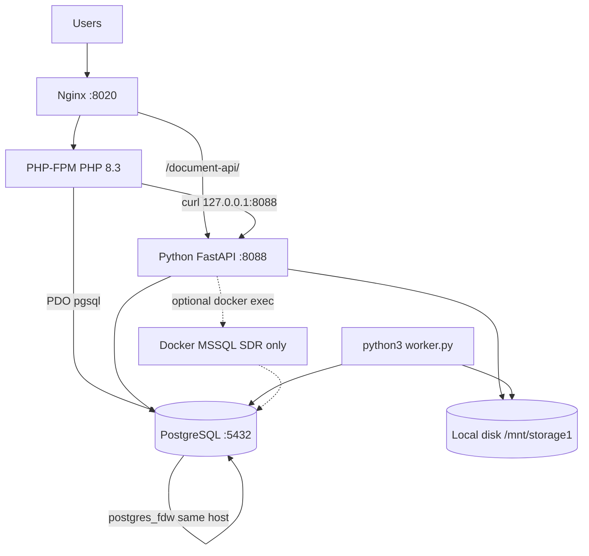
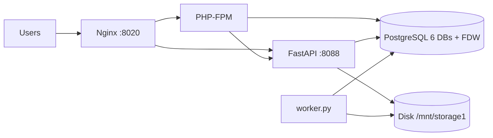

# CDAT — Deployment Architecture & Infrastructure Sizing

**Required production capacity = actual requirement × 1.30 (30% headroom).**

This document sizes production infrastructure from **repository evidence only**. Components not present in the codebase are not recommended. Assumptions are labelled. Live servers were not inspected when this file was written.

Related ops docs: [`DEPLOY.md`](DEPLOY.md), [`SDR_PIPELINE.md`](SDR_PIPELINE.md), [`HANDOVER_CHECKLIST.md`](HANDOVER_CHECKLIST.md).

---

## 1. Repository inventory

### Present and required

| Component | What it is | Evidence | Confidence |
|-----------|------------|----------|------------|
| PHP web app | Server-rendered UI + search backend (`main.php` + `modules/`) | `docs/DEPLOY.md`, `main.php`, `routes/web.php` | HIGH |
| Nginx reverse proxy | Production HTTP front (PHP-FPM + proxy to Python) | `cdat-web.nginx.conf` | HIGH |
| PHP-FPM | Executes PHP (`php8.3-fpm.sock`) | `cdat-web.nginx.conf` | HIGH |
| Python Document API | FastAPI/uvicorn on **8088** | `main.py`, `cdr-import-service/app/main.py` | HIGH |
| In-process import workers | `ThreadPoolExecutor(max_workers=4)` | `cdr-import-service/app/runner.py` | HIGH |
| Filesystem CDR worker | Polls inbox every 10s | `worker.py`, `cdr_import/cli.py`, `docs/DEPLOY.md` | HIGH |
| PostgreSQL 14+ | App + satellite DBs + job queue | `.env.example`, `config/db_connect.php`, `sql/*.sql` | HIGH |
| `postgres_fdw` | Mounts 5 satellite DBs into `CDATDUPL_DB` | `sql/fdw_setup.sql` | HIGH |
| Local disk storage | App root, CDR/SDR files, resumable chunks | `cdr_import/config.py`, `cdat-web.nginx.conf`, `document_processing/resumable_upload.py` | HIGH |
| PHP sessions | File sessions (default) + `user_sessions` table | `modules/common/activity_logger.php`, `sql/cdr_db.sql` | HIGH |
| Health checks | PHP `/health` (DB ping); Python `/health` (liveness only) | `modules/common/health.php`, `cdr-import-service/app/main.py` | HIGH |

### Present but optional (only if SDR uploads are enabled)

| Component | Evidence | Confidence |
|-----------|----------|------------|
| Docker + SQL Server container | `sdr_import/mssql_restore.py` (`docker exec`), `docs/SDR_PIPELINE.md`, `docs/DEPLOY.md` (“out of scope for standard CDR-only deployments”) | HIGH |
| `pyodbc` / ODBC Driver 17 | `sdr_import/config.py`, `cdr-import-service/requirements.txt` | HIGH |

### Present as dev/optional packaging (not the production topology)

| Component | Evidence |
|-----------|----------|
| Apache + `.htaccess` | `.htaccess`: routing for Apache *if used* |
| Docker Compose for import API only | `cdr-import-service/docker-compose.yml` — one service; no PHP, no Postgres, no worker |
| PHP built-in server | `docs/DEPLOY.md`: `php -S localhost:8020 main.php` (local dev) |

### Searched and not found — do not provision

Redis, Memcached, RabbitMQ, Kafka, SQS, Celery, Elasticsearch, MongoDB, MySQL, Kubernetes, Helm, Terraform, Ansible, systemd unit files in-repo, CI workflows, WebSockets, GPU/CUDA/PyTorch/TF, vector DBs, embedding/RAG, dedicated auth IdP, service discovery, load-balancer configs beyond Nginx.

- Redis appears only as a **roadmap idea** (`docs/ROADMAP_10_10.md`). Login lockout is PostgreSQL (`login_attempts`).
- Queue is **PostgreSQL `document_jobs` + local files**, not a broker (`sql/cdr_db.sql`, `document_processing/jobs.py`).
- Locks are **Postgres advisory locks** (`document_processing/locks.py`).

---

## 2. Deployment architecture (as designed)

The app is a **modular monolith on one Linux host**. PHP never talks to satellite DBs directly; it uses one PDO connection to `CDATDUPL_DB`, and FDW makes IR/JRMS/PDACT/rowdy/training tables look local.

```text
Users (browser)
  ↓  HTTP  :8020   (TLS not in nginx template)
Nginx
  ├─ PHP-FPM  →  search UI, login, admin
  │                 ↓  TCP 5432
  │            PostgreSQL
  │              CDATDUPL_DB  ← postgres_fdw → IR_DB, JRMS_DB,
  │                                            PDACT_DB, ROWDY_SHEETS_DB,
  │                                            TRAINING_DB
  │                 ↑  curl  http://127.0.0.1:8088
  └─ /document-api/  →  Python FastAPI (uvicorn)
                         ├─ ThreadPoolExecutor × 4  (import jobs)
                         ├─ local disk  inbox/processing/done/failed
                         └─ [optional] docker exec → MSSQL container
python3 worker.py        (filesystem poll of inbox; separate process)
```



### Compute processes that must run (CDR production)

| Process | Count in code | Can share a server? |
|---------|---------------|---------------------|
| `nginx` | 1 | Yes — designed to |
| `php-fpm` | pool size **not in repo** | Yes |
| `python3 main.py` (uvicorn) | 1 process | Yes — bound to `127.0.0.1:8088` |
| Import threads | **4** (`CDR_IMPORT_WORKERS`) | Inside the API process |
| `python3 worker.py` | 1 | Yes — `docs/DEPLOY.md` requires it |
| `postgres` | 1 instance, **6 databases** | Yes — default `CDR_DB_HOST=localhost` / `127.0.0.1` |

**GPU:** none. The only “gpu” hits are Bootstrap CSS `gpuAcceleration`.

**Containers:** not required for CDR. Docker is required **only** for SDR restore (`docker exec` in `sdr_import/mssql_restore.py`). Compose has **no CPU/RAM limits**.

**Isolation:** docs say isolate MSSQL if SDR is used. PHP, Python, and Postgres are designed colocated (`127.0.0.1`).

**Default disk layout** (from code/scripts):

| Path | Role |
|------|------|
| `/mnt/storage1/cdat-web` | App deploy root (`cdat-web.nginx.conf`) |
| `/mnt/storage1/cdr_documents` | Upload inbox / processing / done / failed |
| `/mnt/storage1/postgres` | Postgres data dir (`scripts/show_size_breakdown.sh`) |
| `/mnt/storage1/mssql/data` | Optional SDR SQL Server data |

---

## 3. Actual resource requirement (before headroom)

### What is known vs assumed

**Known (HIGH)**

- PHP per-request cap: **512 MB**, FastCGI timeout **86400s** (`cdat-web.nginx.conf`).
- PDO: **no persistent connections**; one PDO cached **per FPM worker**; `statement_timeout = 120s` (`config/db_connect.php`).
- Heavy search pages call `set_time_limit(0)` but the DB still kills queries at **120s**.
- Python import concurrency: **4** threads; upload stream chunk **8 MB**; SDR chunk **16 MB**.
- Upload **configured ceiling**: **700 GB/file**, nginx `client_max_body_size 750G`.
- Job poll window: **1800s**.
- No `pm.max_children`, no Postgres `shared_buffers`, no DB size, no user-count in repo.

**Assumptions (explicit — not in repo)**

| ID | Assumption | Why it is needed |
|----|------------|------------------|
| A1 | **15 concurrent interactive users**, **8 concurrent heavy searches** | Internal search app; no SLA/user count in repo |
| A2 | PHP-FPM **`pm.max_children = 16`** | 16 × 512 MB = 8 GB PHP ceiling; matches A1 with spare workers for AJAX |
| A3 | Typical working set per PHP worker **~250 MB** (peak 512 MB) | Limit is 512 MB; not every request hits it |
| A4 | PostgreSQL data size **unknown** | No `pg_database_size` in repo. Checkpointed `cdatpcsuspect` copy implies a **large** table, not a GB figure |
| A5 | Typical CDR file **≪ 700 GB** unless operators use that limit | 700 GB is a config max, not measured volume |
| A6 | Single host, Ubuntu-like Linux | Paths `/mnt/storage1`, `/run/php/php8.3-fpm.sock`, `/home/hyd-cat/...` in scripts |
| A7 | SDR/MSSQL **off** unless `/data-upload/sdr` is used | `docs/DEPLOY.md` |

### Per-component actual (colocated peak)

PHP mostly **waits on Postgres** (120s queries). CPU is not “16 FPM × 1 core”. RAM **is** additive.

| Component | Actual CPU | Actual RAM | Actual storage | GPU | Instances | Justification |
|-----------|----------:|----------:|---------------:|-----|----------:|---------------|
| Nginx | 0.5 vCPU | 0.3 GB | (app tree) | No | 1 | Reverse proxy only |
| PHP-FPM | 2 vCPU | **4.0 GB** typical / **8.0 GB** worst | — | No | 1 pool | A2–A3: 16 × 250 MB; CPU wait-on-DB |
| Python API + 4 threads | 2 vCPU | **4.0 GB** | upload volume | No | 1 | 4 workers + Excel/`openpyxl` spike |
| `worker.py` | 1 vCPU | **2.0 GB** | same upload dirs | No | 1 | Sequential inbox poller |
| PostgreSQL (6 DBs + FDW) | **8 vCPU** | **16.0 GB** | **unknown** | No | 1 | 8 concurrent 120s scans + indexes; RAM is a **floor**, not a measured cache fit |
| OS / page cache | 0.5 vCPU | 2.0 GB | 40 GB OS+app | No | — | Linux + PHP + Python packages |
| **CDR total (actual)** | **14 vCPU** | **28.3–32.3 GB** | see storage | No | **1 host** | Colocated peak |
| Docker MSSQL (SDR only) | +4 vCPU | +8 GB | `.bak` + restore | No | 1 container | Not specified in repo; Microsoft-class assumption |

Use **32 GB RAM actual** for the CDR stack (includes PHP worst-case 8 GB).

### Storage actual

| Volume | Actual | Source |
|--------|-------:|--------|
| OS + app code | ~40 GB | Small PHP/Python tree; round for OS |
| Postgres data | **UNKNOWN** | Measure with `bash scripts/check_server_impact.sh` / `pg_database_size` |
| WAL / temp (~30% of DB) | UNKNOWN | Standard PG operational overhead |
| Upload dirs | **Config max: 700 GB × 2** (inbox + processing) = **1400 GB** if the limit stays | `cdr_upload_config.php`, `cdr_import/config.py` |
| Resumable SDR partials | Inside upload dirs, TTL 168h | `document_processing/resumable_upload.py` |
| `pg_dump` backups | 1× DB size per dump (docs recommend daily cron) | `docs/DEPLOY.md` |
| Logs | Unbounded in code | PHP `error_log`; Python stdout; **no rotation in repo** |

Do **not** treat 1400 GB as measured usage. It is the **configured capability**. If `max_file_size` is lowered (e.g. 50 GB), upload actual becomes ~100 GB.

---

## 4. +30% headroom

```text
Production = Actual × 1.30
```

### Compute (CDR-only, one host)

| Resource | Actual | 30% | Exact | Practical |
|----------|-------:|----:|------:|----------:|
| vCPU | 14 | 4.2 | 18.2 | **20 vCPU** |
| RAM | 32 GB | 9.6 GB | 41.6 GB | **48 GB** |

### Storage

| Resource | Actual | +30% | Practical |
|----------|-------:|-----:|-----------|
| OS + app | 40 GB | 12 GB | **64 GB** OS disk |
| Uploads at **configured 700 GB max** | 1400 GB | 420 GB | **2 TB** upload volume |
| Uploads if max file is **50 GB** (ops change) | 100 GB | 30 GB | **160 GB** |
| PostgreSQL | **measure D** | **0.30D** | **D × 1.30** plus WAL (~0.3D) → plan **~1.7D** on the data disk |
| Backups | 1× D per retained dump | 30% | Separate volume |

### SDR add-on (only if enabled)

| Resource | Actual extra | +30% | Add to host |
|----------|-------------:|-----:|-------------|
| vCPU | 4 | 1.2 | **+6 vCPU** → **26 vCPU** |
| RAM | 8 GB | 2.4 GB | **+12 GB** → **64 GB** |

---

## 5. Deployable mapping

The codebase is **single-server**. A separate DB host is allowed (`CDR_DB_HOST`) but **not required**. A load balancer, second API replica, Redis, and Kubernetes are **not justified**.

```text
Minimum / recommended production host (CDR)
└── One Linux VM or bare metal
    ├── Nginx :8020
    ├── PHP 8.3-FPM
    ├── python3 main.py :8088
    ├── python3 worker.py
    └── PostgreSQL 14+  (6 databases + fdw)
            data:  /mnt/storage1/postgres
            app:   /mnt/storage1/cdat-web
            files: /mnt/storage1/cdr_documents
```

| Server | Role | CPU | RAM | Storage | GPU | Qty | Ports | Colocate? |
|--------|------|----:|----:|---------|-----|----:|-------|-----------|
| **cdat-prod** | All CDR services | **20 vCPU** | **48 GB** | OS 64 GB + PG **D×1.7** NVMe + uploads (160 GB or 2 TB) | No | **1** | 8020 (HTTP), 5432 localhost, 8088 localhost | This **is** the designed layout |
| **cdat-mssql** | SDR restore only | 6 vCPU | 12 GB | `.bak` + SQL data | No | 0 or 1 | Docker internal | Can sit on same host if RAM is 64 GB; docs prefer isolation |

**Do not split PHP and Python** unless there is a measured CPU fight: PHP reaches the API only via `http://127.0.0.1:8088`.

**Do not run two FastAPI replicas** without shared disk: jobs and resumable uploads are **local files** + advisory locks on one Postgres.

### Suggested PHP-FPM (`www.conf`) for 48 GB host

```
pm = dynamic
pm.max_children = 16
pm.start_servers = 8
pm.min_spare_servers = 4
pm.max_spare_servers = 12
pm.max_requests = 500
```

16 × 512 MB = 8 GB worst case for PHP (~17% of 48 GB).

### Suggested PostgreSQL (`postgresql.conf`) for 48 GB host

| Setting | Value | Why |
|---------|-------|-----|
| `shared_buffers` | 12 GB | ~25% of RAM |
| `effective_cache_size` | 24 GB | planner hint; not a reservation |
| `work_mem` | 64 MB | 16 PHP + 8 Python × 64 MB ≈ 1.5 GB extra under load |
| `maintenance_work_mem` | 2 GB | indexes / vacuum |
| `max_connections` | 80 | 16 FPM + ~8 Python + admin |
| `max_wal_size` | 8 GB | large imports |
| `random_page_cost` | 1.1 | NVMe |

Keep `work_mem` modest. High `work_mem` × many connections is how Postgres eats the 30% buffer.

### Python

```
CDR_IMPORT_WORKERS=4
CDR_IMPORT_BATCH_SIZE=5000
```

Keep the API on localhost; Nginx proxies `/document-api/` → `127.0.0.1:8088`.

---

## 6. Architecture type (from repo)

| Pattern | Verdict | Evidence |
|---------|---------|----------|
| Single server / VM / bare metal | **Yes — designed this way** | `127.0.0.1` defaults, unix FPM socket, `/mnt/storage1/*` |
| Modular monolith | **Yes** | One PHP front, one Python helper, one PG |
| Docker Compose full stack | **No** | Compose covers only import API |
| Kubernetes / microservices / serverless | **No** | No manifests, no function platform |
| Cloud-specific | **No** | No AWS/GCP/Azure SDKs |
| Hybrid (Linux app + optional Docker MSSQL) | **Only if SDR on** | `docker exec` restore path |

---

## 7. Scaling

| Service | Scale how | Notes |
|---------|-----------|-------|
| Nginx + PHP | Vertical first | PHP sessions are **local files**. Multiple PHP hosts need sticky sessions **or** shared session storage — **neither is in the repo** |
| FastAPI | **Not safe to replica** without shared `/mnt/storage1/cdr_documents` | In-process thread pool; resumable state on local disk |
| `worker.py` | **One** per inbox directory | Two pollers can race on the same inbox |
| PostgreSQL | Vertical (CPU/RAM/NVMe) | FDW + huge `cdatpcsuspect`; no replica/read-split in code |
| Import workers | Env `CDR_IMPORT_WORKERS` | Raising above 4 increases PG write load |

```text
Minimum Deployment     8 vCPU / 16 GB   — app starts; searches/imports will contend
Recommended (actual)  14 vCPU / 32 GB   — section 3
30%-Headroom          20 vCPU / 48 GB   — section 4
+ SDR                 26 vCPU / 64 GB
```

**Shared storage required for any extra app host:** `cdr_documents` inbox/processing/done/failed.

---

## 8. Production risks

### Codebase-confirmed

| Risk | Evidence |
|------|----------|
| Single host = single point of failure | One nginx, one PHP pool, one API, one PG |
| Nginx template has **no TLS** | `listen 8020;` only |
| Python `:8088` is localhost in docs; Compose publishes `8088:8088` | Do not expose 8088 publicly |
| PHP `/health` checks DB; Python `/health` does **not** | `HealthResponse()` empty |
| No systemd units in repo | Restart policy is an ops gap (`docs/DEPLOY.md` only *recommends* systemd/cron) |
| No log rotation | `error_log` / stdout |
| Disk exhaustion from 700 GB uploads | `max_file_size` 700 GB, `client_max_body_size 750G` |
| 16 FPM × 120s queries can stall the pool | `statement_timeout=120s` + `set_time_limit(0)` |
| DB size not encoded anywhere | Cannot validate disk from git |
| Secrets expected in `.env` / `config/db_config.php` | Must not be in git (`docs/DEPLOY.md`) |
| CDN assets (jsDelivr, cdnjs, Google Fonts) | Breaks if the host has no internet |

### Assumptions / recommendations (not bugs in code)

- Size Postgres RAM after measuring `pg_database_size` and index size; 16 GB actual is a **floor**.
- Lower upload max if 700 GB files are not operationally real.
- Put `pg_dump` on a **separate** volume so backups cannot fill the data disk.

### Pass/fail check for 30% headroom (after deploy)

After CDAT + Postgres + worker are running, trigger one heavy search **and** one CDR import, then:

```bash
mpstat 5 6          # CPU idle should stay ≥ 30%
free -h             # available RAM ≥ 30% of total
df -h / /mnt/storage1 /mnt/storage2
```

Confirm indexes from `docs/DEPLOY.md` exist (`cdatpcsuspect(phone)`, IMEI/celltower, FDW join keys). Missing indexes burn CPU/RAM and wipe the 30% buffer.

---

## 9. Final architecture (CDR production)

One machine; optional MSSQL dashed.



---

## 10. Final infrastructure sizing table

**Scope:** CDR production, SDR off, assumptions A1–A7, Postgres RAM = floor (not measured cache).

| Server / Service | Purpose | Actual CPU | Actual RAM | Actual Storage | Actual GPU | +30% Headroom | Final recommendation |
|------------------|---------|----------:|----------:|----------------|------------|---------------|----------------------|
| Nginx | HTTP reverse proxy | 0.5 vCPU | 0.3 GB | with OS | No | — | Colocate |
| PHP-FPM | Search UI | 2 vCPU | 8 GB peak | with OS | No | — | Colocate; `pm.max_children=16` |
| FastAPI + 4 threads | CDR/SDR document API | 2 vCPU | 4 GB | uploads | No | — | Colocate; `:8088` localhost only |
| worker.py | Inbox poller | 1 vCPU | 2 GB | uploads | No | — | Colocate; **one** process |
| PostgreSQL | Data + FDW + `document_jobs` | 8 vCPU | 16 GB **floor** | **measure D** | No | CPU/RAM in host total | Same host unless D is huge |
| OS | Linux | 0.5 vCPU | 2 GB | 40 GB | No | 64 GB OS disk | Ubuntu 22.04/24.04 |
| **Host total** | **All of the above** | **14 vCPU** | **32 GB** | OS 40 GB + **1.7D** + uploads | **No** | **+4.2 vCPU, +9.6 GB** | **20 vCPU / 48 GB / OS 64 GB / PG disk 1.7D NVMe / upload 160 GB or 2 TB** |
| MSSQL Docker | SDR `.bak` restore | 4 vCPU | 8 GB | bak+data | No | +1.2 vCPU, +2.4 GB | **Only if SDR on:** 26 vCPU / 64 GB |

```text
ACTUAL REQUIREMENT
CPU:       14 vCPU
RAM:       32 GB
Storage:   40 GB OS + PostgreSQL D (unknown) + uploads
           (100 GB typical-assumption OR 1400 GB at config max)
GPU:       none
Instances: 1

+30% HEADROOM
CPU:       +4.2 vCPU
RAM:       +9.6 GB
Storage:   OS → 52 GB; uploads 100→130 GB or 1400→1820 GB; Postgres D→1.3D (plus WAL)

FINAL DEPLOYMENT REQUIREMENT
CPU:       20 vCPU          (26 if SDR)
RAM:       48 GB            (64 GB if SDR)
Storage:   64 GB OS disk
           PostgreSQL volume = ~1.7 × measured D  (NVMe)
           Upload volume     = 160 GB  OR  2 TB if 700 GB files stay enabled
GPU:       none
Instances: 1 Linux host
```

If measured Postgres size is hundreds of GB, **raise RAM first** (vertical), then re-apply ×1.30. 16 GB for Postgres would be **under-provisioned** for a multi-hundred-GB `cdatpcsuspect`.

### Runtime versions (from repo)

| Component | Spec |
|-----------|------|
| OS | Ubuntu 22.04 or 24.04 LTS |
| Nginx | current stable |
| PHP | **8.3-FPM** (conf socket); 8.1+ acceptable if socket path is updated |
| PHP packages | `php-fpm`, `php-pgsql`, `php-mbstring`, `php-xml`, `php-curl` |
| PostgreSQL | **14+** with `postgres_fdw` |
| Python | **3.10+** (`psycopg2`, FastAPI/uvicorn; Excel: `openpyxl`/`xlrd`/`pandas`; SDR: `pyodbc` + ODBC Driver 17) |
| Docker | only for SDR MSSQL |

### Ports

| Port | Bind | Public? |
|------|------|---------|
| 8020 | Nginx | Yes (add TLS; not in template) |
| 8088 | FastAPI | **No** — `127.0.0.1` |
| 5432 | PostgreSQL | **No** — localhost / private |

---

## 11. Evidence & confidence

```text
PostgreSQL is required (6 databases + FDW).
Evidence: .env.example, config/db_connect.php, sql/cdr_db.sql,
          sql/fdw_setup.sql, docs/DEPLOY.md
Reason: PHP PDO and Python psycopg2 connect to CDR_DB_*; FDW mounts satellites.
Confidence: HIGH

Nginx + PHP-FPM is the production web path.
Evidence: cdat-web.nginx.conf, docs/DEPLOY.md
Confidence: HIGH

Python FastAPI on 8088 is required for document upload.
Evidence: main.py, cdr-import-service/app/main.py,
          modules/data-upload/cdr_upload_config.php, nginx /document-api/
Confidence: HIGH

Job “queue” is PostgreSQL document_jobs + local files, not Redis/Kafka.
Evidence: sql/cdr_db.sql, cdr-import-service/app/runner.py,
          document_processing/jobs.py
Confidence: HIGH

Import concurrency is 4 threads.
Evidence: CDR_IMPORT_WORKERS default 4 in runner.py
Confidence: HIGH

No GPU / no AI stack.
Evidence: no torch/tf/cuda; Bootstrap gpuAcceleration only
Confidence: HIGH

Designed as a single Linux server.
Evidence: 127.0.0.1 DB and API; /mnt/storage1 paths; no K8s/Terraform
Confidence: HIGH

Docker MSSQL is optional (SDR only).
Evidence: docs/DEPLOY.md, docs/SDR_PIPELINE.md, sdr_import/mssql_restore.py
Confidence: HIGH

PHP-FPM child count is not in the repository.
Evidence: no www.conf / php-fpm pool file
Confidence: N/A — assumption A2

PostgreSQL data size is not in the repository.
Evidence: no size dumps; scripts/check_server_impact.sh measures live
Confidence: size UNKNOWN (LOW for GB figures, HIGH that the table is large)

20 vCPU / 48 GB is actual×1.30 under assumptions A1–A7, not a measured production profile.
Confidence: MEDIUM for CPU/RAM, LOW for disk until D is measured
```

---

## 12. Three views

### A. What the codebase requires

One Linux host: Nginx, PHP-FPM, FastAPI `:8088`, `worker.py`, PostgreSQL with six databases and FDW, local disk for uploads. No Redis, no K8s, no GPU, no extra load balancer. Docker/MSSQL only for SDR.

### B. What is actually deployed

**Not filled in.** Live SSH/server audit has not been run. Measure with:

```bash
bash scripts/check_server_impact.sh
```

### C. What should be deployed

`Actual × 1.30` under assumptions A1–A7:

- **20 vCPU / 48 GB / 1 host** for CDR
- **64 GB OS disk**
- **Postgres disk = 1.7 × measured size**, NVMe
- **Upload disk = 160 GB** after lowering the 700 GB cap, **or 2 TB** if that cap stays
- **64 GB RAM / 26 vCPU** only if SDR is in production

Do **not** add Kubernetes, extra API replicas, Redis, or a GPU.

| Action | What |
|--------|------|
| Remain | Single-host Nginx + PHP + Python + Postgres |
| Upgrade | RAM/CPU to 20 vCPU / 48 GB if the current box is smaller; Postgres disk after measuring D |
| Do not add | K8s, Redis, GPU, extra load balancer, second FastAPI without shared disk |
| Optional isolate | Docker MSSQL if SDR is enabled |
| Ops change | Lower 700 GB upload max unless that size is real |

---

## 13. How to lock disk size (live)

On the production host:

```bash
bash scripts/check_server_impact.sh
```

Then:

```text
data_disk     ≥ (all Postgres DBs + WAL/temp ~30% of DB) / 0.70
upload_disk   ≥ (2 × largest_file_you_actually_allow) / 0.70
backup_disk   ≥ (1 full pg_dump × retention days) / 0.70
```

Idle CPU ≥ 30%, available RAM ≥ 30%, and free disk ≥ 30% on every volume after a heavy search **and** a CDR import is the acceptance test for this document.