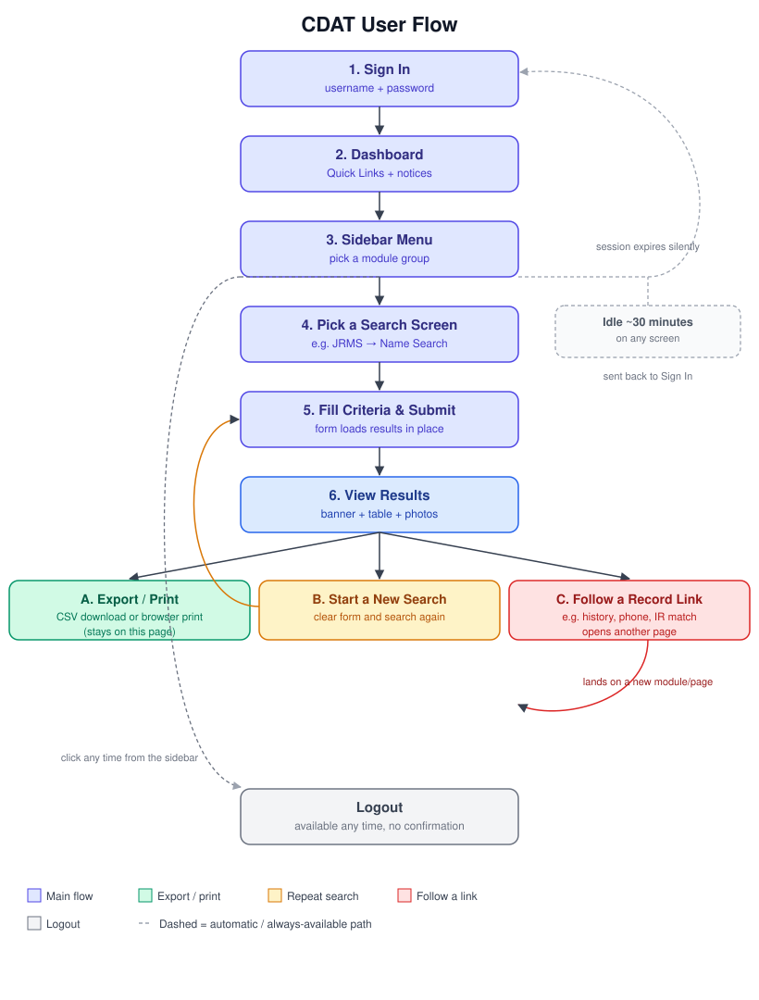

# CDAT — User Flow Guide

*Call Data Analysis Tool — Hyderabad City Police*

This guide walks through how to use the CDAT web application from signing in to running a search and signing out. It's written for day-to-day users of the search screens, not for developers.

---

## 1. Signing In

Go to the CDAT login page. You'll see two fields:

| Field | Notes |
|---|---|
| Username | Your assigned account name |
| Password | Has a show/hide toggle; the form warns you if Caps Lock is on |

Click **Sign In**. What happens next:

- **Success** — the button changes to "Signing in…" then "Signed in. Opening your dashboard…" and you're taken to your Dashboard.
- **A field was left blank** — a red message appears under that specific field (e.g. "Enter your username.").
- **Wrong username or password** — a red banner reads "Username or password is incorrect." The password field is cleared so you can try again. (The message doesn't say which of the two was wrong — that's intentional.)
- **Account deactivated** — "This account is deactivated. Contact an administrator."
- **Too many failed attempts** — after 5 incorrect tries, the form locks for 15 minutes: "Too many failed login attempts. Try again later."

> There is no self-service "Forgot password" link. If you're locked out or need a password reset, contact your administrator directly.

---

## 2. Your Dashboard

After signing in, you land on the **Dashboard**. This is your home base — the sidebar menu (covered next) is always visible alongside it. The dashboard itself shows:

- A **Quick Links** grid — shortcut tiles to the pages you use most. You can pin pages here yourself so you don't have to dig through the sidebar every time.
- Two standing notices: where to email raw call-data files for report generation, and where to send requests for suspect-image searches.

---

## 3. Getting Around: The Sidebar Menu

The sidebar on the left lists every module you have access to. It works in two layers:

- **Groups** (e.g. "JRMS", "Call Details") are buttons, not links — clicking one just expands or collapses its list of screens in place. You never leave the current page by clicking a group.
- **Screens** (the items inside a group, e.g. "Name Search") are links — clicking one takes you to that search page.

What you see depends on your account's role. A regular account sees the everyday search modules; **Data Upload** and **Administration** only appear for accounts with upload or admin permissions. There's no badge or label anywhere that spells out your role — the menu itself *is* the indicator: if you can see a group, you have access to it.

The modules available:

| Group | What it's for |
|---|---|
| Data Upload *(uploader/admin only)* | Import CDR/SDR call records and custom tables; view upload history |
| Summary | Totals, date-range summaries, ISD/new-contact summaries, state-wise summaries |
| Call Details | Movement tracking, comparisons and calls between two numbers, calls between dates |
| CDAT | Contact lookups, single and bulk |
| IMEI Search | Cross-reference phones and IMEIs |
| Address | Single and bulk address lookups |
| Day/Night Location | Frequent locations by time of day, by date range |
| Offenders List | Habitual offenders, undetected cases |
| Others | Cell ID search, vehicle search, common contacts, trainings, offender subclassification |
| Interrogation Reports | Search interrogation records by name, name + crime head, or gender + crime head |
| JRMS | Jail release records — by name, by date range, or by police station |
| PD Act | PD Act records — by name, MO, or police station |
| Administration *(admin only)* | User activity log, SQL console, create users |

---

## 4. Running a Search — Step by Step

Every search screen in CDAT follows the same pattern, whichever module you're in. Here's that pattern walked through concretely using **JRMS → Name Search** as the example.

**Step 1 — Open a search screen.** In the sidebar, click **JRMS** to expand it, then click **Name Search**. You'll see an empty form.

**Step 2 — Fill in your search criteria.** For Name Search that's:
- **Name** — free text (required)
- **Crime Head** — a searchable dropdown (required)

(Other JRMS screens ask for a date range instead of a name, or a police station instead of a crime head — but it's always a short form like this.)

**Step 3 — Submit.** Click **Search**. The page doesn't reload — your results appear in place a moment later. (If your browser has JavaScript turned off, the page will do a normal reload instead; it still works the same way.)

**Step 4 — Read the results.** You'll see:
- A plain-language banner summarizing what was searched, e.g. *"ACCUSED RELEASED FROM JAIL UNDER CRIME HEAD … BY NAME …"*
- A results table with prisoner photo, name, father's name, crime details, phone, ID proof, address, jail, admission/release dates.
- The table shows 15 rows at a time with paging controls; you can change how many rows are shown per page.
- If nothing matches, you'll see a plain "No records found" notice instead of an empty table.

**Step 5 — Export or print (optional).** Two buttons sit above the table:
- **Export CSV** — downloads the *entire* result set (not just the page you're looking at) as a spreadsheet file.
- **Print** — expands all rows and opens your browser's print dialog.

**Step 6 — Follow a link from a result (optional).** Some cells in the table are clickable and take you further:
- The "times released" count → that prisoner's full jail-release history (every JRMS record under the same case reference).
- A phone number → that number's record in the CDAT Contacts module.
- "IR Available" (when shown) → the matching Interrogation Report.

These jumps take you out of the search screen entirely into another part of the record — use your browser's back button, or the sidebar, to return to where you were.

**Step 7 — Start a new search.** Just fill the form again, or click a different screen in the sidebar.

---

## 5. The Flow at a Glance

The diagram below shows the same journey visually — sign in, land on your dashboard, pick a module and screen from the sidebar, run a search, then either act on the results or start over. The dashed path shows what happens if you're idle too long: you're sent back to the login page automatically.

---

## 6. Signing Out & Session Timeout

**Signing out.** Click **Logout** at the bottom of the sidebar. You're signed out immediately — there's no confirmation prompt — and returned to the login page.

**If you're logged out unexpectedly:** CDAT signs you out automatically after about 30 minutes of inactivity, as a security measure. There's no warning beforehand — the next thing you click will simply send you back to the login page. This is expected behavior, not an error. Just sign in again to continue where you left off (any unsaved search criteria will need to be re-entered, since nothing is saved until you submit a search).

---

*This guide covers the JRMS module in full detail as a representative example. Every other search module in the sidebar (Summary, Call Details, PD Act, Interrogation Reports, etc.) follows the identical fill-in → submit → results → export/print → drill-down pattern described in Section 4, just with different search fields.*
